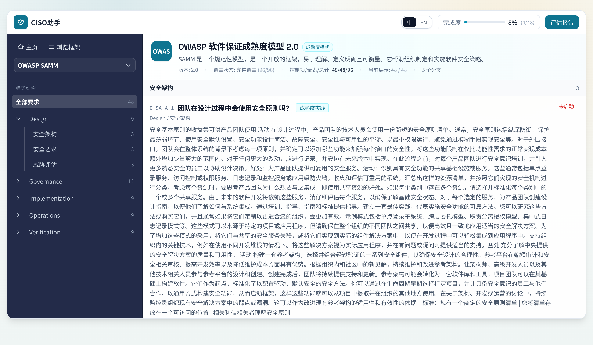
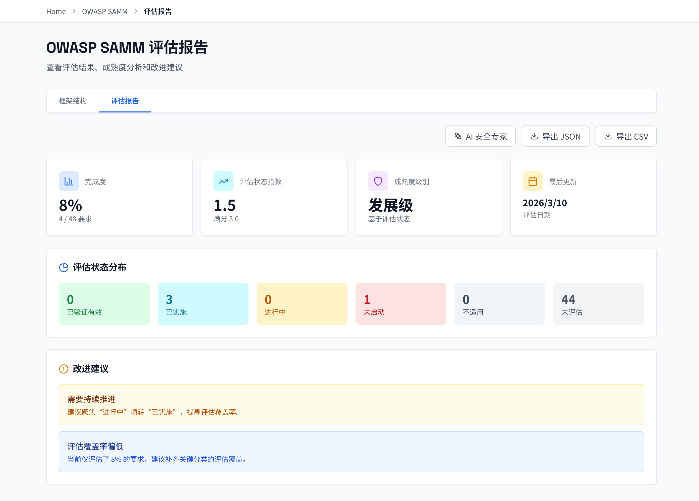
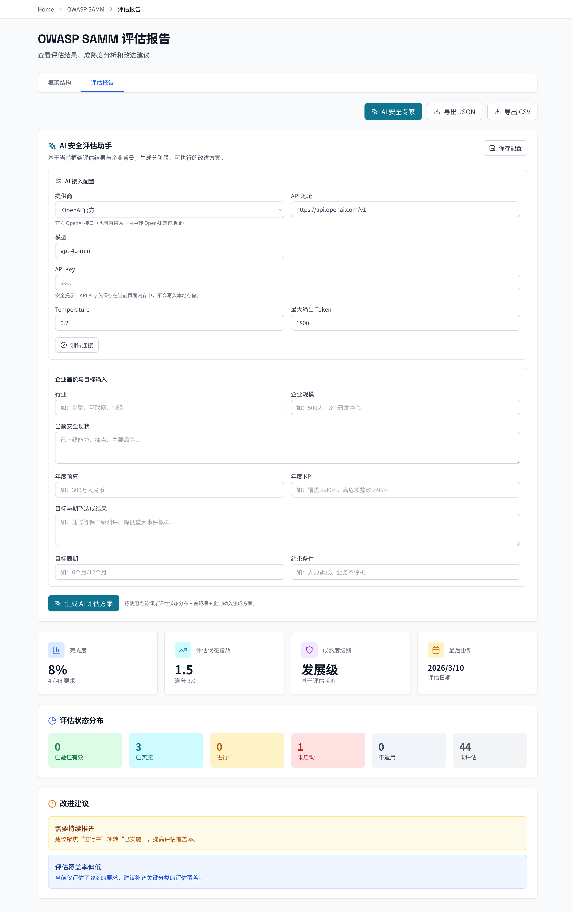

<div align="center">
  <h1>Ciso-Assistant / CISO助手</h1>
  <p><strong>面向 CISO 的安全框架评估、治理改进与 AI 辅助决策工作台</strong></p>
  <p>
    
    
    
    
  </p>
</div>

## 项目概述

`Ciso-Assistant` 聚合国内外安全框架，支持按框架语义进行展示、逐条评估、报告输出与 AI 辅助改进建议。

当前数据规模（基于 `public/data/frameworks/index.json` 与 `index-en.json`）：

- 框架总数：`32`
- 中英双语索引：`32 + 32`
- 要求总量：`5013+`
- 中国框架：`4`
- 国际框架：`28`

## 项目目录结构与作用

```text
.
├─ src/
│  ├─ app/
│  │  ├─ frameworks/[id]/page.tsx                     # 框架主页面（左侧导航 + 右侧控制项）
│  │  ├─ frameworks/[id]/report/page.tsx              # 评估报告页
│  │  ├─ frameworks/[id]/requirements/[reqId]/page.tsx# 控制项详情页
│  │  ├─ frameworks/[id]/assessment/page.tsx          # 旧评估入口（重定向到框架主页）
│  │  ├─ api/ai-assistant/analyze/route.ts            # AI 评估助手后端接口
│  │  └─ layout.tsx                                   # 全局布局与元信息
│  ├─ components/
│  │  ├─ FrameworkSidebar.tsx                         # 左侧框架导航
│  │  ├─ RequirementList.tsx                          # 右侧控制项列表与筛选
│  │  ├─ RequirementCard.tsx                          # 单条控制项评估卡片
│  │  ├─ ReportClient.tsx                             # 报告页统计与导出
│  │  ├─ AIAssessmentAssistant.tsx                    # AI 安全专家交互组件
│  │  └─ framework-modes/*                            # default/sammy/regulation 三种展示模式
│  ├─ hooks/useAssessment.ts                          # 评估状态与备注读写逻辑
│  ├─ lib/assessment-model.ts                         # 统一评估状态模型定义
│  ├─ lib/data-loader-server.ts                       # 服务端框架数据加载
│  ├─ lib/data-loader.ts                              # 客户端框架数据加载
│  └─ config/framework-display-profiles.json          # 框架展示 profile 配置
├─ public/
│  ├─ data/frameworks/                                # 框架数据（中英双语）
│  │  ├─ index.json / index-en.json                   # 框架索引与统计
│  │  └─ <framework-id>.json / <framework-id>-en.json
│  ├─ favicon.ico                                     # 浏览器标签图标
│  └─ site.webmanifest                                # PWA/站点元配置
├─ scripts/frameworks/
│  ├─ verify-data-quality.mjs                         # 数据质量门禁
│  ├─ verify-presentation-gate.mjs                    # 展示逻辑门禁
│  ├─ verify-profile-gate.mjs                         # profile 一致性门禁
│  ├─ sync-index-counts.mjs                           # 索引计数同步
│  └─ pull-*.py / sync-*.py                           # 官方源拉取与同步脚本
├─ docs/
│  ├─ schemas/requirement-v2.schema.json              # requirement-v2 结构规范
│  └─ specs/                                          # requirement-v2 示例与样本
├─ .github/workflows/                                 # CI 与仓库保护流程
├─ package.json                                       # npm scripts 与依赖入口
└─ README.md                                          # 项目说明
```

主要子文件说明（建议先读）：

- `src/components/framework-modes/FrameworkModeLayout.tsx`：按框架类型切换右侧展示模式的核心入口。
- `src/components/RequirementCard.tsx`：控制项评估状态（6档）与备注编辑的主交互组件。
- `src/components/ReportClient.tsx`：评估进度、状态分布、导出与 AI 助手入口。
- `src/hooks/useAssessment.ts`：评估数据存取和聚合计算，供框架页与报告页共用。
- `src/lib/assessment-model.ts`：统一定义评估状态枚举、标签映射和统计辅助函数。
- `src/config/framework-display-profiles.json`：声明每个框架使用何种展示语义（default/sammy/regulation）。
- `scripts/frameworks/verify-profile-gate.mjs`：防止框架展示 profile 与数据结构失配。
- `public/data/frameworks/index.json`：中文主索引（框架列表、版本、要求数）的基准文件。

## 支持的完整框架列表（32）

| # | ID | 名称 | 版本 | 区域 | 要求数 |
|---|---|---|---|---|---:|
| 1 | owasp-asvs | OWASP Application Security Verification Standard | 4.0.3 | global | 286 |
| 2 | owasp-samm | OWASP Software Assurance Maturity Model | 2.0 | global | 48 |
| 3 | nist-ssdf | NIST Secure Software Development Framework | 1.1 | us | 42 |
| 4 | nist-csf-2.0 | NIST Cybersecurity Framework 2.0 | 2.0 | us | 106 |
| 5 | nist-800-53 | NIST Special Publication 800-53 Revision 5.2.0 | Rev 5.2.0 | us | 993 |
| 6 | nist-800-34 | NIST Contingency Planning Guide for Federal Information Systems | Rev 1 | us | 29 |
| 7 | nist-800-171 | Protecting Controlled Unclassified Information | Rev 3 | us | 97 |
| 8 | cis-csc-v8 | CIS关键安全控制 第8.1版 | 8.1 | global | 153 |
| 9 | cyberfundamentals-20 | CCB CyberFundamentals Framework 2.0 | 2.0 | eu | 71 |
| 10 | dsomm | DevSecOps Maturity Model | 2024 | global | 189 |
| 11 | bsimm-15 | Building Security In Maturity Model 15 | 15 | global | 128 |
| 12 | nis2 | Network and Information Security Directive 2 | 2023 | eu | 43 |
| 13 | aima | AI Maturity Assessment Model | 1.0 | global | 150 |
| 14 | cmmc-l1-l2 | Cybersecurity Maturity Model Certification Levels 1-2 | 2.0 | us | 110 |
| 15 | iso27001-2022 | 信息安全、网络安全和隐私保护管理体系要求（含2024修订） | 2022+Amd1:2024 | global | 93 |
| 16 | iso-27002-2022 | Information Security Controls | 2022 | global | 93 |
| 17 | iec-62443-4-1 | Secure Product Development Lifecycle for IACS | 2018 | global | 52 |
| 18 | secure-controls-framework | Secure Controls Framework | 2024 | global | 1239 |
| 19 | cloud-controls-matrix | Cloud Controls Matrix | 4.0 | global | 261 |
| 20 | mlps-2.0 | 网络安全等级保护基本要求 GB/T 22239-2019 | 2.0 | cn | 345 |
| 21 | cn-cybersecurity-law | 中华人民共和国网络安全法（2025年修正） | 2016（2025修正） | cn | 81 |
| 22 | cn-data-security-law | 中华人民共和国数据安全法 | 2021 | cn | 55 |
| 23 | cn-personal-information-protection-law | 中华人民共和国个人信息保护法 | 2021 | cn | 74 |
| 24 | nist-800-161 | NIST SP 800-161 Rev.1 Cybersecurity Supply Chain Risk Management Practices | Rev.1 | us | 88 |
| 25 | pci-dss | 支付卡行业数据安全标准 v4.0.1 | 4.0.1 | global | 18 |
| 26 | eu-gdpr | 欧盟通用数据保护条例 Regulation (EU) 2016/679 | 2016/679 | eu | 99 |
| 27 | eu-dora | Regulation (EU) 2022/2554 Digital Operational Resilience Act | 2022/2554 | eu | 12 |
| 28 | eu-ai-act | Regulation (EU) 2024/1689 Artificial Intelligence Act | 2024/1689 | eu | 12 |
| 29 | eu-cyber-resilience-act | Regulation (EU) 2024/2847 Cyber Resilience Act | 2024/2847 | eu | 12 |
| 30 | owasp-api-top10-2023 | OWASP API Security Top 10 (2023) | 2023 | global | 10 |
| 31 | owasp-masvs-2.1 | OWASP Mobile Application Security Verification Standard 2.1 | 2.1 | global | 12 |
| 32 | owasp-asvs-5.0 | OWASP Application Security Verification Standard 5.0 | 5.0.0 | global | 12 |

## 核心能力

- 框架页即评估页：在控制项页直接设置评估状态和备注。
- 三种展示模式：`default`、`sammy`、`regulation`。
- 统一评估状态：`未评估 / 不适用 / 未启动 / 进行中 / 已实施 / 已验证有效`。
- 报告页：完成率、状态分布、JSON/CSV 导出。
- AI 安全专家：基于已评估结果与企业上下文生成落地建议。
- 多模型接入：OpenAI、Anthropic、Ollama、DeepSeek、MiniMax、Kimi 与通用适配。

## 快速开始

### 1) 环境要求

- Node.js `>= 18`
- npm `>= 9`

### 2) 安装依赖

```bash
npm ci
```

### 3) 启动开发环境

```bash
npm run dev
```

默认地址：`http://localhost:5001`

### 4) 生产构建与启动

```bash
npm run build
npm run start
```

## 常用命令

| 命令 | 说明 |
|---|---|
| `npm run dev` | 本地开发（5001 端口） |
| `npm run build` | 生产构建 |
| `npm run start` | 生产运行 |
| `npm run lint` | 代码检查（若配置 ESLint） |
| `npm run frameworks:verify-data-quality` | 数据质量校验 |
| `npm run frameworks:verify-presentation-gate` | 展示逻辑门禁校验 |
| `npm run frameworks:verify-profile-gate` | 展示 profile 规则校验 |
| `npm run frameworks:sync-index` | 同步框架索引统计 |
| `npm run frameworks:derive` | 派生翻译数据 |
| `npm run frameworks:validate` | 翻译结构校验 |

## 命令实测结果（2026-03-11）

| 命令 | 结果 | 说明 |
|---|---|---|
| `npm ci` | 通过 | 依赖可正常安装 |
| `npm run dev` | 通过 | `http://localhost:5001` 正常启动 |
| `npm run build` | 通过 | Next.js 生产构建成功 |
| `npm run start` | 通过 | 已调整为 `next start -p 5001`，并完成 HTTP 健康检查 |
| `npm run lint` | 通过（有 1 条 warning） | `ReportClient.tsx` 存在 `useCallback` 依赖 warning，不阻断 |
| `npm run frameworks:verify-data-quality` | 通过 | `64` 文件校验通过 |
| `npm run frameworks:verify-presentation-gate` | 通过 | `64` 文件展示门禁通过 |
| `npm run frameworks:verify-profile-gate` | 通过 | `32` 框架 profile 门禁通过 |
| `npm run frameworks:sync-index` | 通过 | 索引已同步，计数无变更 |
| `npm run frameworks:validate` | 通过 | 翻译结构校验通过（含法规英文包例外白名单） |
| `npm run frameworks:derive` | 长耗时任务 | 全量翻译依赖外部翻译服务，建议按框架分批执行或在异步任务中运行 |

## 运行演示截图

> 以下截图由本仓库本地运行（`http://localhost:5001`）采集。

### 1) 框架页评估（左侧导航 + 右侧末级控制项）



### 2) 报告页（进度与分布）



### 3) AI 安全专家（配置与分析）



## AI 评估助手配置

前端入口：报告页右上角 `AI 安全专家`。

后端接口：`POST /api/ai-assistant/analyze`

- `requestType = connection-test`：连通性测试
- `requestType = analysis`：生成结构化改进方案（差距、优先级、90天计划、预算/KPI建议）

## 数据与质量门禁

- 数据目录：`public/data/frameworks/`
- 双语文件：`<id>.json` / `<id>-en.json`
- 展示策略：`src/config/framework-display-profiles.json`

GitHub Actions：

- `.github/workflows/ci.yml`
- `.github/workflows/repo-guard.yml`

## 仓库可见性与清理策略

- 公开仓库仅保留可复现项目所需文档。
- 采集过程中的临时报告、检查点和本地原型草稿不纳入版本库。
- 通过 `.gitignore` 屏蔽 `docs/framework-checkpoints/`、`docs/ui-prototypes/` 等生成物。

## 许可证

- 本项目采用 `GNU Affero General Public License v3.0`（见 `LICENSE`）。
- SPDX 标识：`AGPL-3.0-only`。
- 该许可证允许商用，但要求衍生/修改版本在分发或网络服务场景下继续开源并提供对应源代码。

## 免责声明

本项目用于安全治理评估与流程改进，不直接替代法律意见、审计意见或认证结论。
