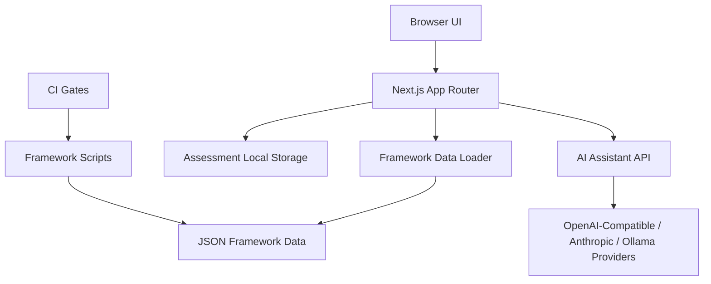

<div align="center">
  <h1>Ciso-Assistant / CISO助手</h1>
  <p><strong>面向 CISO 的安全框架评估、治理改进与 AI 辅助决策工作台</strong></p>
  <p>
    
    
    
    
  </p>
</div>

## 项目概述

`Ciso-Assistant` 是一个以“框架对齐 + 评估执行 + 报告输出 + AI 专家建议”为核心流程的安全治理平台。
它聚合国际与国内安全框架，支持多种展示模式（控制框架/成熟度模型/法规义务），并提供统一评估状态体系与可导出报告。

当前数据规模（基于 `public/data/frameworks/index.json`）：

- 框架总数：`32`
- 中英双语索引：`32 + 32`
- 要求总量：`5013+`
- 中国框架：`4`
- 国际框架：`28`

## 核心亮点

- 框架驱动评估：在框架页面直接完成逐条评估，不再割裂到独立“答题页”。
- 三种展示模式：
  - `default`：标准控制项视图（ISO/NIST/OWASP 等）
  - `sammy`：成熟度模型风格视图（如 SAMM/BSIMM/DSOMM）
  - `regulation`：法规义务视图（法条依据、义务强度、适用范围）
- 统一评估状态：`未评估 / 不适用 / 未启动 / 进行中 / 已实施 / 已验证有效`。
- 报告导出：支持 JSON / CSV 导出，便于审计留痕与管理汇报。
- AI 评估助手：基于当前评估结果 + 企业上下文生成可执行改进方案。
- 多模型接入：支持 OpenAI、Anthropic、Ollama、DeepSeek、MiniMax、Kimi 和通用适配。
- 数据质量门禁：内置基线校验、翻译校验、展示门禁与 CI 检查。

## 架构总览



## 功能流程

1. 选择目标框架（左侧常驻导航）
2. 在右侧末级控制项直接设置评估状态并填写备注
3. 查看实时完成率与状态分布
4. 进入报告页导出 JSON/CSV
5. 打开 AI 评估助手，输入企业上下文并生成 90 天与 6-12 个月改进方案

## 快速开始

### 1) 环境要求

- Node.js `>= 18`
- npm `>= 9`

### 2) 安装依赖

```bash
npm ci
```

### 3) 启动开发环境

```bash
npm run dev
```

默认地址：`http://localhost:5001`

### 4) 生产构建与启动

```bash
npm run build
npm run start
```

## 常用命令

| 命令 | 说明 |
|---|---|
| `npm run dev` | 本地开发（5001 端口） |
| `npm run build` | 生产构建 |
| `npm run start` | 生产运行 |
| `npm run lint` | 代码检查（若配置 ESLint） |
| `npm run frameworks:verify-data-quality` | 数据质量校验 |
| `npm run frameworks:verify-presentation-gate` | 展示逻辑门禁校验 |
| `npm run frameworks:verify-profile-gate` | 展示 profile 规则校验 |
| `npm run frameworks:sync-index` | 同步框架索引统计 |
| `npm run frameworks:derive` | 派生翻译数据 |
| `npm run frameworks:validate` | 翻译结构校验 |

## AI 评估助手配置

前端入口：报告页右上角 **AI 安全专家**。

支持 Provider 预设：

- OpenAI（`openai-compatible`）
- Anthropic（`anthropic-messages`）
- Ollama（`ollama-chat`）
- DeepSeek（`openai-compatible`）
- MiniMax（`openai-compatible`）
- Kimi / Moonshot（`openai-compatible`）
- Generic（可手动选择三种协议）

后端接口：`POST /api/ai-assistant/analyze`

- `requestType = connection-test`：连通性测试
- `requestType = analysis`：输出 CISO 视角的结构化建议（关键结论、优先级差距、90 天计划、预算建议、KPI 等）

## 数据与展示策略

- 框架数据目录：`public/data/frameworks/`
- 中英文双版本：`<id>.json` / `<id>-en.json`
- 展示模式配置：`src/config/framework-display-profiles.json`
- 默认按框架类型分配模式，并可按框架 id 精确覆盖

## 评估模型

评估状态定义位于 `src/lib/assessment-model.ts`：

- `UNASSESSED`
- `NOT_APPLICABLE`
- `NOT_STARTED`
- `IN_PROGRESS`
- `IMPLEMENTED`
- `VERIFIED_EFFECTIVE`

评估数据默认保存在浏览器本地：

- `localStorage key`: `security-framework-assessments`

## 项目结构

```text
src/
  app/
    api/ai-assistant/analyze/route.ts
    frameworks/
    search/
  components/
    framework-modes/
    AIAssessmentAssistant.tsx
    RequirementList.tsx
    ReportClient.tsx
  hooks/
    useAssessment.ts
  lib/
    assessment-model.ts
    framework-presentation.ts
    data-loader.ts
    data-loader-server.ts

public/data/frameworks/
  index.json
  index-en.json
  *.json
  *-en.json

scripts/frameworks/
  pull-*.py
  verify-*.mjs
  translate-framework-en-to-zh.py
```

## CI 与质量门禁

GitHub Actions：

- `.github/workflows/ci.yml`
  - 安装依赖
  - 运行数据质量检查
  - 运行展示门禁
  - 执行生产构建
- `.github/workflows/repo-guard.yml`
  - 阻止 `.next/`、`node_modules/` 等产物入库
  - 限制超大文件

## 路线图

- 增加更多官方源自动同步器与差异审计
- 评估数据多用户/多项目后端化（替代本地存储）
- AI 报告模板多视角输出（CISO / 总监 / 执行团队）
- 报告导出增强（HTML/PDF）与版式主题化

## 免责声明

本项目用于安全治理评估与流程改进，不直接替代法律意见、审计意见或合规认证结论。
对于高风险决策，请结合组织法务、审计与安全管理流程进行复核。
